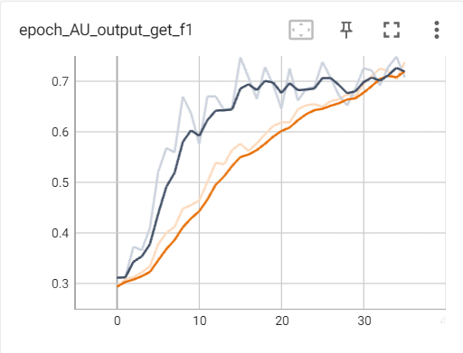
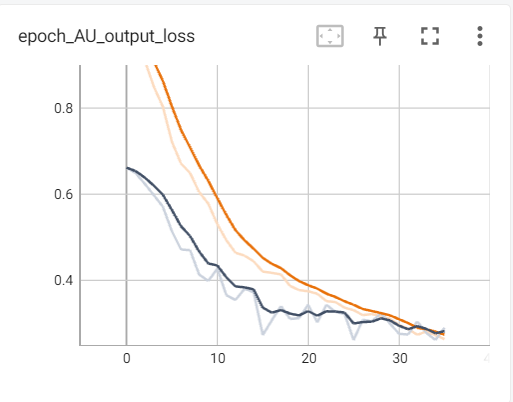
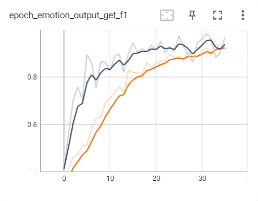

# Action Unit and Emotion Recognition
In this task, students are required to train an end-to-end deep convolutional neural network on a subset of The Extended Cohn-Kanade Dataset (CK+) provided. The dataset consists of 560 labelled images from 123 subjects. The labelled attributes include:

- High Level Emotion (HLE): indicating whether the subjects’ emotion is “Positive”, “Negative” or “Surprised”
- FACS (Facial Action Coding System) codes: Whether the subject did a particular facial action, 1 for yes, 0 for no

According to the dataset, there are a total of 15 FACS codes depicting the subject’s brow, lip, cheek, chin and jaw, mouth and eye movements.  

  
The best model had a 87.35% F1 score for HLE and 72.03% for FACS codes.

<table align="center">
<thead>
     <tr align="center">
        <td>
        
Action Unit Branch F1 Score

        </td>
        <td>
        
Action Unit Loss

        </td>
     </tr>
</thead>
    
<tr align="center">
    <td></td>
     <td></td>
</tr>

<thead>
     <tr align="center">
        <td>
        
Emotion Recognition F1 Score

        </td>
        <td>
        
Emotion Recognition Loss

        </td>
     </tr>
</thead>

<tr align="center">
    <td></td>
     <td></td>
</tr>

</table>

## What I learned:
1. Design and create an end-to-end deep learning system
2. Data Analysis and Machine Learning using Jupyter Notebook
3. Image Data Analysis
4. Image Data Transformation
5. Image Data Augmentation
6. Deep Learning with images
7. Analyse and Evaluate the output of neural network models
8. Provide an ultimate judgement of the final trained model in a real-world setting
